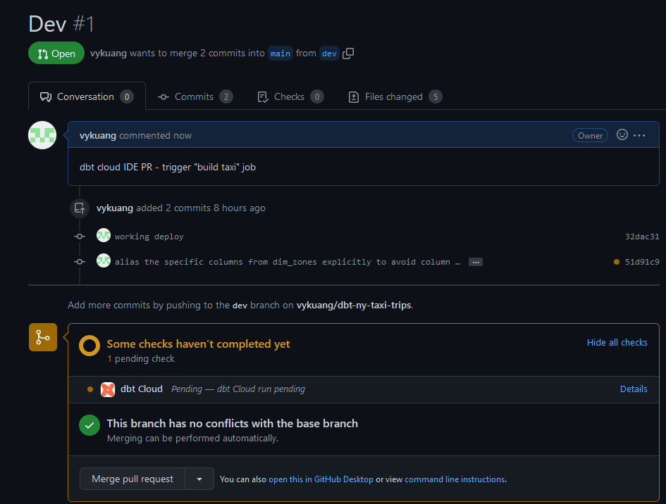

# Week 4 - Analytics Engineering - Homework

1. num rows in `fact_trips`: 115,333,131

  - need to deduplicate. Should be around 63M
  - kind of worring: `stg_yellow` has 28M duplicate `tripid`s...
  - `stg_green` has 800K
  - also a worrying number of `payment_types` not in specified vars.

1. distribution between service types (green vs yellow) between 2019 and 2020?

  - use google data studio (now known as looker) or metabase
  - 6.9% green vs 93.1% yellow

1. num rows in `stg_fhv_tripdata`: 43261276, or 40569536???

  - Actually, there are a lot of duplicates for `tripid` even when I include `dropoff_datetime` as part of the surrogate key
  - `affiliated_base_num` is the culprit
  - for the exact same trip, there are many duplicates with different `affiliated_base_num`
  - may be an idiosyncrasy of their record keeping, but I think they're the same trip?
  - one example I saw had 39 identical pu/do ID, and pu/do datetimes
  - use the `row_number() over partition` trick?
  - dropped to 14633830 after deduplication

1. Create a core model for the stg_fhv_tripdata joining with dim_zones. 
Similar to what we've done in fact_trips, keep only records with known pickup and dropoff locations entries 
for pickup and dropoff locations

  - try `row_number() over partition by (...) as row_num ... where row_num = 1`
  - expect fewer number of rows, removing all nulls in PU and DOLocationID
  - 22,967,197

1. What is the month with the biggest amount of rides after building a tile for the fact_fhv_trips table.
Create a dashboard with some tiles that you find interesting to explore the data. 
One tile should show the amount of trips per month, as done in the videos for fact_trips, based on the fact_fhv_trips table.

  - `CREATE TABLE duplicate column name: locationid` error
  - Caused by joining `dim_zones` twice; both appear as `locationid`.
  - Since my `pickup_locationid` and `dropoff_locationid` are there, I don't need them in my result table
  - how to remove them from my joins?
  - on bigquery, the duplicate column names from joining `dim_zones` twice resolved itself by suffixing with `_1`; somehow `dbt` didn't know?
  - one solution is explicitly referencing each column and aliasing:

  ```sql
  select
    fhv_taxi_trips.*,
    pickup_zone.borough as pickup_borough,
    pickup_zone.zone as pickup_zone,
    pickup_zone.service_zone as pickup_service_zone,
    dropoff_zone.borough as dropoff_borough,
    dropoff_zone.zone as dropoff_zone,
    dropoff_zone.service_zone as dropoff_service_zone,
  from fhv_taxi_trips
  join ...
  ```
  
  - same method as the original `facts_trips` upon further inspection
  - worked in `dev`
  - deployment needs changes to be `push`d to remote repo before taking effect. `commit` and `sync` before re-running the job
  - try creating `pull` request to trigger the `build taxi` dbt job
  - pull request brings you to a comparison page to view the changes about to be committed
    - [see docs here](https://docs.github.com/en/pull-requests/collaborating-with-pull-requests/incorporating-changes-from-a-pull-request/merging-a-pull-request)
  - from the webpage, `Open Pull Request`
  - enter a comment
  - 
  - after `dbt` job finishes as part of the checks, we can `merge` the pull request
    - can be done automatically
  - lots of `borough` having `null`s in our `fhv_fact_trips`
  - need to use `inner join on dim_zones` so that whichever zones from `stg` that don't exist in `dim_zones` will not make it to `fhv_fact_trips`
  - cut rows down to 22M, from 40M
  - also noticing a drastic decrease in trip_records for all months after january. No idea why.
    - BQ public dataset only has fhv data up to 2017.
    - answer would be january by a landslide???
    - this meshes with the extremely large size of the january file vs the rest.
