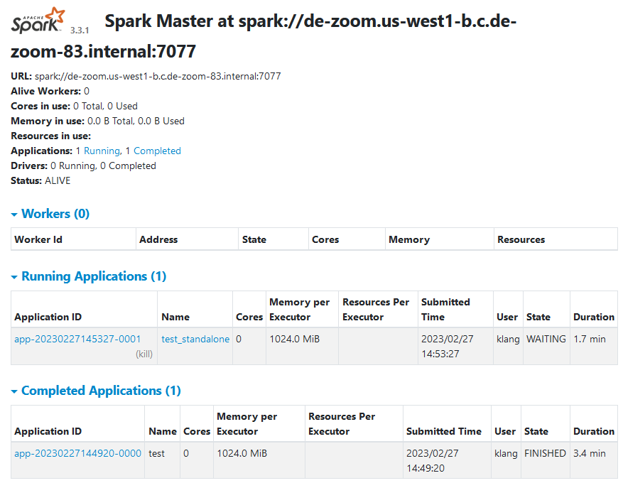

# Week 5 - Batch Processing with Spark

Installing local spark seems to be a huge hassle. Will work locally with my existing 3.2.1 spark installation and move on to spark container when working in GCP compute

Most notes are in the jupyter notebook.

Concepts covered

- reading files
- schema enforcement
- repartition to optimize cluster workload
- functions and UDF

## Casting schemas

If source is already in parquets, it seems much harder to enforce schema on read. Instead I read the parquet as is, and recasted each column according to their column names, e.g. IDs are ints, datetimes are timestamps, fees and charges are floats

`DataFrame.withColumns(cols_map)` was used; returns a new dataframe.

## Spark Architecture

### `SparkSession`

Entrypoint to programming spark. The python script needs to instantiate a session to create and manipulate RDDs and dataframes via spark API. The `SparkSession` instance gives access to its own instance of `SparkContext`, which is used less frequently after 2.0. Access via `SparkSession.sparkContext`

Session is defined in the `pyspark.sql` module

Best to deal with dataframes

### `SparkContext`

defined as `pyspark.SparkContext`, this is an alternate entrypoint for scripts to use spark API. Represents the connection to a Spark cluster

More suited for RDD ops

### driver

The self-contained pyspark app (written with `pyspark` API). Must explicitly create a `SparkSession` instance in order to read, manipulate, and write output files

## Spark Cluster

So far we've ran spark in local environment, `local[*]`, and the spark context includes the master, which is also on the same machine. In practice they are separate entities.

- spark code is developed on some machine
- the job is submitted to the cluster via the `master`
    - the `master` is accessed via some URL; so far it's been `localhost:4040`
    - `master` coordinates the tasks between all the `executors`
- `executors` are separate machines inside the cluster which perform the tasks and process the data
    - if one `executor` goes down, the `master` is aware, and reassigns accordingly
- the dataset should be partitioned such that the data processing tasks can be easily distributed amongst the executors
- data is sourced from online buckets, e.g. S3, GCS
    - used to be hadoop/HDFS where data was already on the machine, and code was downloaded to the executor
    - *data locality*
    - now that storage and bandwidth is cheaper, download the dataset instead
    - data no longer needs to be kept on executors
    - no overheaded needed to maintain hadoop/hdfs

### Group By in Spark

Sample query to group revenue and number of trips by hour and zone:

```sql
SELECT
    date_trunc('hour', lpep_pickup_datetime) AS hour,
    PULocationID AS revenue_zone,
    CAST(SUM(total_amount) AS DECIMAL(6,2)) AS amount,
    COUNT(1) AS num_records
FROM
    green
WHERE
    CAST(lpep_pickup_datetime as DATE) BETWEEN "2020-01-01" AND "2021-12-31"
GROUP BY
    hour, revenue_zone
ORDER BY
    hour, revenue_zone
```

The DAG will show two stages:

1. Preparation
2. `Group By`

What's happening in the cluster:

1. Stage one - group by within partition of each executor
    1. Each executor is given some partition of the whole dataset `green`
    1. Each executor performs the task on their own partition, and return the `GROUP BY`'d result
        1. The result will look like some miniature version of the actual table, containing records for most keys in our query (i.e. hour and revenue zone), but with results coming only from the given partition
        1. The sub-results are passed to stage two
1. Stage two - reshuffle and reduce
    1. `Reshuffling` - Take all sub-results from each executor, and reshuffle into partitions via the keys, i.e. hour and revenue zone, so that records from each executors become grouped by their keys
        1. This is an expensive process
    1. Reduce - now that keys are grouped on same machines, sum to get our result

+-------------------+------------+-------+-----------+
|               hour|revenue_zone| amount|num_records|
+-------------------+------------+-------+-----------+
|2020-01-01 00:00:00|           7| 769.73|         45|
|2020-01-01 00:00:00|          17| 195.03|          9|
|2020-01-01 00:00:00|          18|   7.80|          1|
|2020-01-01 00:00:00|          22|  15.80|          1|
|2020-01-01 00:00:00|          24|  87.60|          3|
|2020-01-01 00:00:00|          25| 531.00|         26|

        1. 

### Shuffling

Given a list of phone call records with datetimes, how would we calculate number of calls per day?

- set `day` as key
- for each phone call on that day, emit `1`
- sum values for each day, i.e. key

What if this list of records is spread across the cluster? How would we sum the `1`s? Eventually each machine needs to have all the values for their assigned keys; if A has 90% of the records for day 1 and B has 10% of records for day 1, neither can produce the answer, and so either A or B must have all records of day 1. `Shuffling` refers to getting all records with the same key to the same machine

`JOIN` in particular makes use of shuffling, since it always requires two tables to join on some fields. For each unique value, or key, in that `JOIN ON` field, all records must be in the same chunk. If we `JOIN`d on country code, each chunk must have all records for the country codes they're assigned. 

During `JOIN`, it is imperative that records belonging to each key are partitioned in the same chunk. This way, when SQL `JOIN`s country code `CA`, it does not need to look through the entirety of the second table; it only needs to look for the partition which contains `CA`. This pre-partitioning enabled by shuffling accelerates `JOIN`s, even though it's an expensive process in itself.

### Join

`JOIN` always makes extensive use of shuffling, much like `GROUP BY`; their internal operation is similar in this sense.

In our taxi dataset where we've grouped by `hour` and `zone`, we have two tables `green` and `yellow`. To `JOIN` on those keys, the dataset must be shuffled so that each partition contains all records for whichever keys they've been assigned. Only then can the partitions be put together, and return our result.

#### Broadcast exchange

When joining a large table with a much smaller table, i.e. `zones_lookup`, spark is smart enough to not shuffle the whole thing. Instead, spark sends a copy of `zones_lookup` to each and every executor. The `revenue` dataset *does* get partitioned throughout the cluster, and to make that join, each executor performs a lookup operation for each record in the `revenue` partition using the local copy of `zones_lookup`

The smaller table is *broadcasted* to each executor

## Resilient Distributed Datasets

RDDs are collections of objects; dataframe is built on top of RDD, with a schema added

Operations done on dataframe can also be executed on the underlying RDDs

### Operations on RDDs

- .rdd to access the underlying RDD from dataframe
- map
- filter
- reduceByKey
- toDF(schema=...) to return it back to dataframe


### mapPartition

`mapPartitions` takes a *partition* to return *another partition*

> RDD partition -> `mapPartitions` -> RDD partition

So why use it over `map`? When the dataset cannot fit in memory. If we had 1TB to `map` a prediction model, there wouldn't be enough RAM. `mapPartitions` can divvy up the dataset to apply it partition by partition

## Spark in GCP

### Connecting to GCS

1. Download the cloud storage connector in the form of a `.jar` from https://cloud.google.com/dataproc/docs/concepts/connectors/cloud-storage#getting_the_connector
1. Install the connector by configuring `SparkConf` and `SparkContext`
1. `df_green = spark.read.parquet('gs://<data_lake>/data/parts/green/*/*')`

### Creating standalone spark cluster

`spark = SparkSession.builder.master("local[*]")` created a local master *along with the cluster of workers* for us to run spark locally. Now we'll set up workers *outside* the master host

[Offical docs on setup](https://spark.apache.org/docs/latest/spark-standalone.html)

- In standalone mode, each node on the cluster must have a compiled version of Spark
- `cd $SPARK_HOME && ./sbin/start-master.sh` starts the standalone master server
    - this prints a `spark://HOST:PORT` URL which is used when connecting workers to the master
    - also visible on master's web UI (which is different from the master)
        - by default this is `http://localhost:8080/`, not `4040` like before
        - access by port forwarding `8080` in VS code
        - master URL: `spark://<instance_name>.<region>.<proj_name>.internal:7077` since we're running on GCP VM
    - at this point we have no workers attached to the master
    - attempting to run `spark.read.parquet` returns this error:

    ```bash
    23/02/27 14:54:34 WARN TaskSchedulerImpl: Initial job has not accepted any resources; check your cluster UI to ensure that workers are registered and have sufficient resources
    ```

    

    - `./sbin/stop-master.sh` stops the master

- `cd $SPARK_HOME && ./sbin/start-worker.sh <master_spark_URL>` starts the worker node and connects them to master
    - can run on same machine as master, so we're still on our VM
    - has its own web UI @ `http://localhost:8081/`
        - `--webui-port` can specify the port 
    - the job will start running once master has this worker available
    - `./sbin/stop-worker.sh` to stop the worker on this node

### Spark-submit

The python script won't specify the master or any spark configuration. It just says what needs to be done. `spark-submit` lets us configure the following

- `--num-executors` how many executors
- how much resources for each executors
    - `--executor-memory`
    - `--total-executor-cores`
- which spark master
    - `--master`
- additional `jar`s
    - `--jars path/to/jar`

More importantly we also need to specify `--class` and `--deploy-mode`

```bash
./bin/spark-submit \
  --class <main-class> \
  --master spark://207.184.161.138:7077 \
  --executor-memory 20G \
  --total-executor-cores 100 \
  --num-executors 50 \
  --deploy-mode <deploy-mode> \
  --conf <key>=<value> \
  --conf <key2>=<value2> \
  --jars path/to/gcs_jar
  
  examples/src/main/python/pi.py \
      --arg1 val1 \
      --arg2 val2
```

Since we can configure master host and JAR in `spark-submit`, we do not need to do so in our pyspark script. However we still need to configure the hadoop config to make use of the GCS jar inside the script.